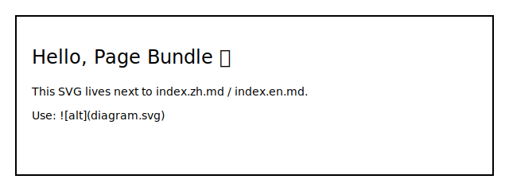

This is a demo post for validating:

- Page bundle resources (SVG/PDF)
- Build-time math rendering (avoid `$...$`)
- giscus comments (shared thread between translations)

## Resource examples

SVG:

PDF attachment (via shortcode):



## Math examples

Inline: \(a^2 + b^2 = c^2\)

Block:

\[
\int_{-\infty}^{\infty} e^{-x^2} dx = \sqrt{\pi}
\]


